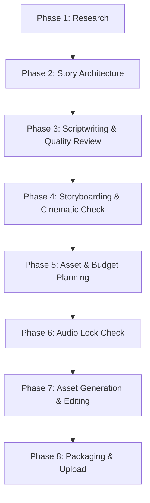

# 🎬 LEELA Studios — Production Workspace v1.0

Welcome to the official production workspace of LEELA Studios. This repository hosts the canonical strategy, brand specifications, scriptwriting guides, and actual media assets for the creation of cinematic, culturally authentic narratives.

---

## 📂 Workspace Directory Structure

The project is organized into structured, numeric categories to prevent bloat and maintain asset and history continuity:

*   **`00_MASTER/`**: Contains the locked, canonical blueprints for the entire studio.
    *   `MASTER_INDEX.md`: Quick-reference map of all core regulations.
    *   `PRODUCTION_SYSTEM.md`: Locked SOPs and step-by-step pipeline schedules (including the LEELA Cinematic Rule).
    *   `SCRIPT_WRITING_BIBLE.md`: Standard rules for pacing, hooks, and 75-point grading.
    *   `VISUAL_STYLE_BIBLE.md`: Guidelines for art styles, lighting, and composition.
    *   `VISUAL_QC_MANUAL.md`: Visual quality checks for exports and animations.
    *   `KRISHNA_BRAND_IDENTITY.md`: Character designs, color palette, and language settings.
    *   `KRISHNA_CHANNEL_STRATEGY.md`: Channel positioning, formatting rules, and SEO rules.
*   **`01_EPISODES/`**: Structured by episode folders (e.g., `V001/`, `V002/`).
    *   `V001/RESEARCH_V001_KRISHNA_BIRTH.md`: Purana scriptural citations and chronological events list.
    *   `V001/ARCHITECTURE_V001_KRISHNA_BIRTH.md`: Act-by-act story arc outline.
    *   `V001/SCRIPT_V001_PART[1-4].md`: Segmented narration draft files.
    *   `V001/STORYBOARD_V001.md`: Visual framing, camera instructions, and SFX cues for each scene.
    *   `V001/EDL_V001.md`: Timeline blueprints (Ken Burns settings, overlays, transitions).
    *   `V001/FOCUS_GROUP_V001.md`: Feedback reports from test audiences.
    *   `V001/PRE_PRODUCTION_VALIDATION_V001.md`: Compliance report cards.
    *   `V001/Hero_Shots/`: Production folders for pre-rendering active video clips.
*   **`02_ASSETS/`**: Centralized library of approved reusable elements.
    *   `Approved/`: Locked video renders and hero shots for multi-episode recycle.
*   **`09_ARCHIVE/`**: Historical repository containing deprecated drafts, rejected renders, and old templates. **No files are ever permanently deleted.**

---

## ⚡ Production Pipeline Workflow

For every episode, the Production Director and Studio Manager execute the following pipeline in sequence:



1.  **Scriptural Alignment**: Root all story beats in the Puranas (`01_EPISODES/V[XXX]/RESEARCH_*`).
2.  **3-1-3-1 Script Pacing**: Compose scripts with alternating short-long-short-long sentence rhythms.
3.  **LEELA Cinematic Rule**:
    *   Determine scene emotional intensity (Level 1–5).
    *   Map to the corresponding production tier (Level 1 static image → Level 5 custom video).
    *   Only use motion when motion itself carries the emotion.
4.  **Audio Quality Gate**: Enforce the `AUDIO_LOCK_CHECKLIST` before generating images.
5.  **Grandmother Check**: Ensure all visual and verbal descriptions are child-friendly and devotely respectful.

---

## 🛠️ Developer Setup & Tooling

This repository is initialized as a production-grade Python project managed by [uv](https://github.com/astral-sh/uv).

### Prerequisites
- Python 3.12
- `uv` (Fast Python package installer and resolver)

### Getting Started

1. **Install Dependencies & Set Up Virtual Environment:**
   ```bash
   make install
   ```
   This will create a virtual environment (`.venv`) and install all development tools (`ruff`, `black`, `pytest`).

2. **Linting and Formatting:**
   - Run code linters:
     ```bash
     make lint
     ```
   - Automatically format code:
     ```bash
     make format
     ```
   - Check format style:
     ```bash
     make format-check
     ```

3. **Running Tests:**
   ```bash
   make test
   ```

### Project Architecture

In addition to the master/episode structures, the codebase is modularized with the following production pipeline directories:
- `config/`: Configuration manager and environment settings
- `pipeline/`: Main orchestrator connecting providers, timelines, and renderers
- `pixverse/`: Custom Pixverse generation client and wrapper
- `providers/`: External APIs and services wrappers (audio, subtitles, etc.)
- `renderer/`: Video/audio compositing and rendering engine
- `timeline/`: Dynamic EDL (Edit Decision List) and scene composition engine
- `subtitles/`: Automatic subtitle generation and styling module
- `scripts/`: Custom tooling scripts and helpers
- `tests/`: Automated test suite

