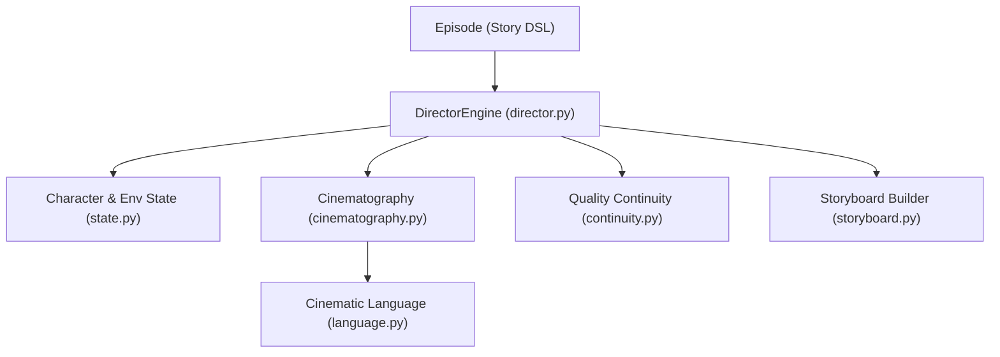

# LEELA Studio Director AI Documentation

The Director AI translates Story DSL scripts into cinematic shot designs, thinking like a film director rather than a simple prompt writer.

## 🏗️ Director Architecture

---

## 🎭 Character & Environment State Engines
- **CharacterState**: Tracks emotions, costumes, injuries, facial expressions, and poses across contiguous shots.
- **EnvironmentState**: Models storm intensity, rain levels, fog density, light torch levels, and time of day to enforce strict visual consistency.

---

## 🎬 Cinematic Language Engine
Translates abstract instructions into industry-standard director terms:
- Framings map to focal lengths (e.g. `85mm portrait lens` for close ups, `35mm anamorphic` for wide shots).
- Movements describe dollies, cranes, and tracking pans.
- Lighting presets cast volumetric shafts and side-lit golden hues.

---

## 📊 Shot Importance & Provider Selection
Every shot receives an importance score deciding the cheapest workflow to preserve budget limits:
- **`HERO`**: Crucial plot beats. Triggers high-res video generation (e.g. PixVerse).
- **`IMPORTANT`**: Secondary narrative beats. Recommends image animation.
- **`BACKGROUND`**: Establishing shots. Resolves to static images or existing archive cache elements.
