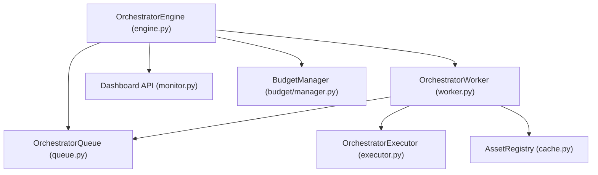
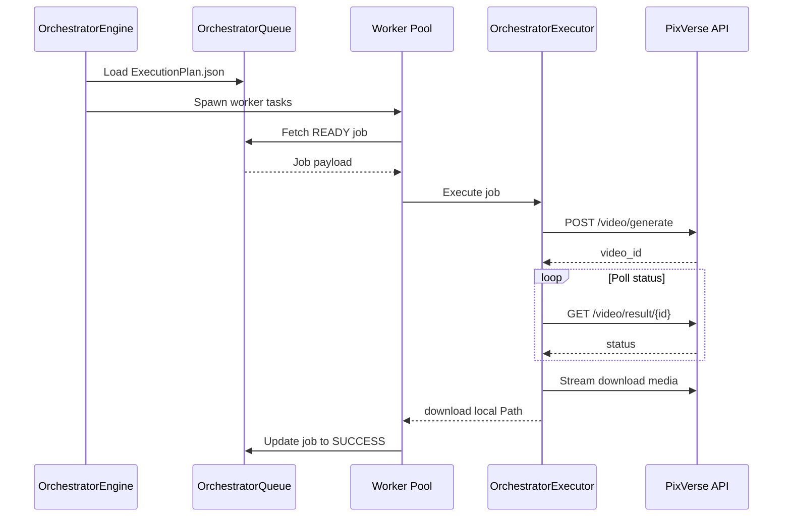

# LEELA Studio Orchestrator Architecture

The Generation Orchestrator automates the execution of compiled plans, orchestrating parallel worker pools and resilient pipeline components.

## 🏗️ Architecture

---

## 🏃 Sequence Diagram

