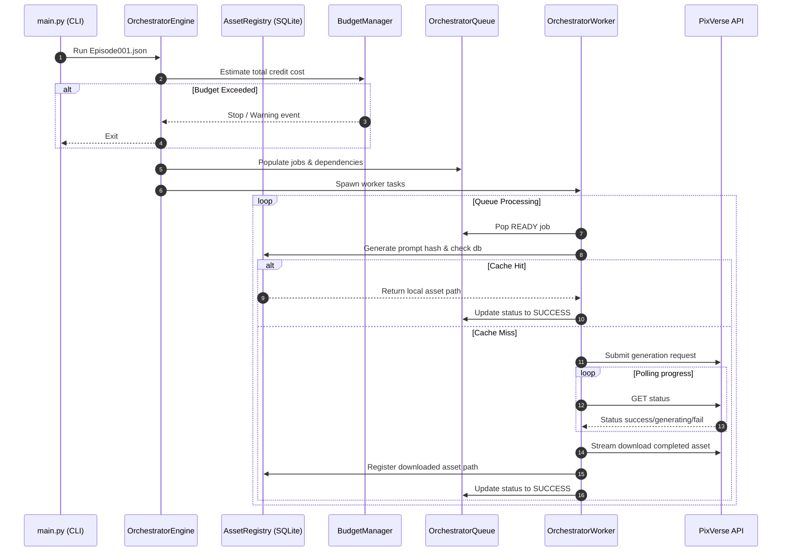

# Generation Orchestrator Lifecycle Documentation

This document explains the execution workflow, state transitions, retry mechanisms, smart caching, and budget management of the Generation Orchestrator.

---

## 🏗️ Complete Execution Lifecycle



---

## 🔄 Queue Lifecycle
The Orchestrator Queue transitions job states as follows:

```
[ WAITING ] 
     │ (All dependencies succeed)
     ▼
 [ READY ]
     │ (Worker pops job)
     ▼
[ RUNNING ] ─────► [ SUCCESS ] (Completed successfully)
     │
     ▼ (Error occurs)
  [ RETRY ]
     │
     ├─► [ RUNNING ] (Retries remaining)
     └─► [ FAILED ] (Max retries exceeded)
```

---

## 🔄 Retry Lifecycle
When a job fails due to network disconnects, HTTP 429 rate limits, or transient provider timeouts:
1. The exception is intercepted.
2. The failure is recorded in `logs/failures.json`.
3. If retries remain and production mode is active, the job state changes to `RETRY`.
4. Applies exponential backoff sleeping before queueing again:
   `sleep_seconds = 2.0 ** retry_attempt`

---

## 💾 Cache Lifecycle (Smart Asset Reuse)
- **Prompt Hash Generation**: Resolves a unique SHA256 signature from prompt, negative prompt, reference assets list, duration, resolution, provider, and aspect ratio.
- **SQLite Lookup**: Queries `cache/asset_registry.db`. If found, checks if file exists locally. If yes, marks job as SUCCESS instantly (Cache Hit).
- **JSON Registration**: In addition to SQLite, registers details to `assets/index.json` to keep a clean catalog for future episodes.

---

## 💰 Budget Lifecycle
- **Limits**: Configured for Daily, Episode, and Monthly thresholds.
- **Deduction**: Accumulates credits on job completion.
- **Validation**: Prior to spawning workers, computes total plan credit usage. If limits are exceeded, pauses execution immediately to prevent overrun.
