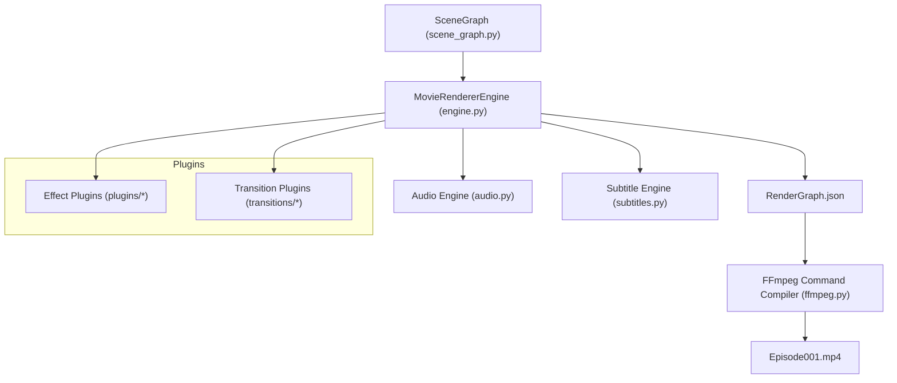

# Movie Rendering Engine Architecture

The Movie Rendering Engine compiles scene graph multi-tracks, transitions, effects, and subtitles into finished MP4 movies.

## 🏗️ Architecture

---

## 💾 Render Cache
To speed up iterations:
1. Generates SHA256 signatures of plan contents.
2. If signature exists under `cache/renderer/`, copies cached MP4 instantly, skipping rendering.

---

## 🏃 Commands
- **Render full episode**:
  `python main.py render Episode001.json --profile youtube`
- **Render preview**:
  `python main.py preview Episode001.json`
- **One command production**:
  `python main.py make Episode001.json`
