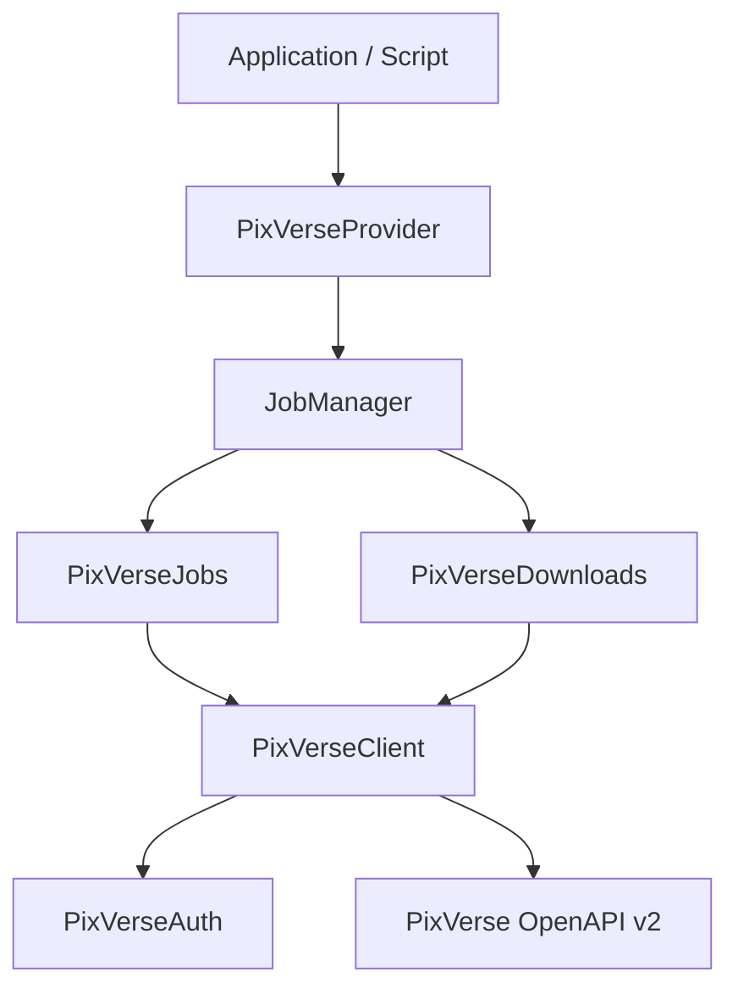

# PixVerse SDK Architecture & Documentation

This document explains the reusable PixVerse API SDK architecture, classes, and lifecycle processes.

## SDK Directory Structure
```
pixverse/
├── auth.py         # Credentials manager (Headers / trace-ids)
├── client.py       # Async HTTPX Client (Rate-limiting, backoffs)
├── exceptions.py   # SDK custom Exception hierarchy
├── downloads.py    # Download Manager (Streaming, directories, metadata)
├── jobs.py         # Task submissions, Polling, & JobManager queue
├── models.py       # High-level Pydantic models (JobStatus, VideoJob)
└── schemas.py      # OpenAPI spec JSON schemas (Requests / Envelopes)
```

---

## 🏗️ SDK Architecture



1. **`PixVerseClient`**: Async client wrapper built on `httpx.AsyncClient` that handles all low-level networking, connection pooling, and error handling.
2. **`PixVerseAuth`**: Responsible for appending `API-KEY` and unique `Ai-trace-id` (UUID) to request headers.
3. **`PixVerseJobs`**: Wraps the REST endpoints (Text-to-Video, Image-to-Video, Status/Result) with Pydantic request/response structures.
4. **`PixVerseDownloads`**: Handles downloading completed assets into structured folder trees and writing `asset.json` files beside the downloaded videos.
5. **`JobManager`**: Orchestrates high-level job submissions, queueing, active job tracking, checkpoint recovery, and parallel execution.

---

## 🔒 Authentication Flow
Authentication requires a valid PixVerse API Key. This key is set in `config/settings.yaml` or as `PIXVERSE_API_KEY` in environment variables.

Every outgoing HTTP request adds the following headers:
- `API-KEY`: The developer's key.
- `Ai-trace-id`: A unique request UUID generated per request to track requests and prevent duplicate execution.

---

## 🔄 Request Lifecycle (Rate Limits & Retries)
The custom HTTP client ensures robust transmission:
1. **Initiation**: The request is generated with an associated `request_id`.
2. **Execution**: The client executes the query using connection pooling.
3. **Structured Logging**: Start, end, and duration timings are tracked and logged via `structlog`.
4. **429 Handling / Backoff**:
   - If an HTTP `429 (Rate Limit)` is returned, the client raises `PixVerseRateLimitError`.
   - The handler catches this error, applies exponential backoff (`sleep = base * (2 ** (attempt - 1))`), and retries the request up to the maximum configured retries.
   - Any HTTP status code >= 400 results in appropriate `PixVerseAPIError` or `PixVerseAuthError`.

---

## ⏳ Polling Lifecycle
Since video generation is asynchronous, the JobManager handles polling:
1. **Submission**: Job is submitted and returns a `video_id`.
2. **Checkpoint Registration**: The job is added to the active jobs dict and written to `cache/active_jobs.json` to enable recovery if the process crashes.
3. **Polling loop**:
   - The worker queries `/openapi/v2/video/result/{video_id}`.
   - If status is `5` (Generating), the worker sleeps for the `polling_interval` and repeats.
   - If status is `1` (Success), the loop breaks and proceeds to download.
   - If status is `7` (Moderation Failed) or `8` (Failed), the job is removed from tracking and raises a `RuntimeError`.

---

## 💾 Download Lifecycle
Once generation succeeds:
1. **Directory Creation**: The download manager ensures directories exist like `downloads/Episode001/Scene001/`.
2. **Streaming**: The file is streamed in chunks via HTTPX to prevent memory leaks for large video assets.
3. **Metadata Persistence**: Generates `Shot001_asset.json` containing:
   - `job_id`, `prompt`, `references`, `provider`, `generation_time`, `seed`, `duration`, `resolution`, `created_at`, and `local_path`.
