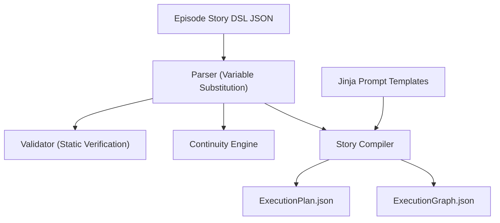

# LEELA Studio Story Engine Documentation

The Story Engine serves as the core compiler of cinematic content into pipeline-executable structures.

## 🏗️ Architecture

---

## 📜 Story DSL Specification
Story files are structured using an custom JSON format defining Episode details, variables, defaults, characters, locations, and scenes.

### Features
1. **Variables**: Define global keys in `"variables"`. Use `${name}` syntax across scene/shot parameters to evaluate them.
2. **Scene Defaults**: Scenes can specify defaults (e.g., `camera_default`, `lighting_default`, `provider_default`) that individual shots inherit unless overridden.
3. **Global Defaults**: Establish standard properties like aspect ratios, resolutions, visual style instructions, and negative prompts.

---

## 🔄 Continuity Validation
The `ContinuityEngine` dynamically evaluates visual attributes:
- **Locations**: Flags warnings if contiguous shots share a location but change lighting parameters without a transition scene.
- **Characters**: Verifies if characters referenced in shots are defined within the Episode's global character registry, ensuring costume attributes map appropriately.
